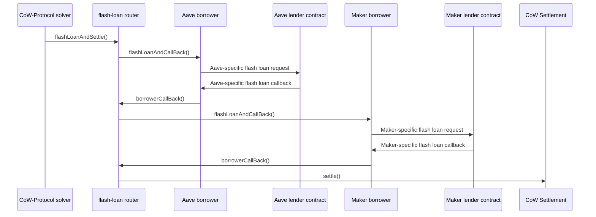

Flash Loan Router implements a modular architecture that separates concerns between routing logic, lender-specific adapters, and settlement execution. This design enables support for multiple flash loan providers while maintaining a secure and predictable execution flow.

## Architecture overview

The system consists of four main components:

<CardGroup cols={2}>
  <Card title="Flash Loan Router" icon="route">
    Core contract that orchestrates flash loans and settlement execution
  </Card>
  <Card title="Borrower adapters" icon="plug">
    Lender-specific contracts that handle protocol differences
  </Card>
  <Card title="Flash loan lenders" icon="vault">
    External protocols (Aave, Maker) that provide liquidity
  </Card>
  <Card title="CoW Settlement" icon="handshake">
    Target settlement contract where trades are executed
  </Card>
</CardGroup>

## Component interactions

The following diagram illustrates the call flow for a settlement using two flash loans (Aave and Maker):



<Note>
The call context never changes throughout execution. Each call increases the call depth, and all calls unwind after settlement completes. This ensures atomic execution.
</Note>

## Core contracts

### FlashLoanRouter

The router is the entry point and orchestrator for all flash loan settlements. It manages the execution flow and ensures security properties are maintained.

**Key responsibilities:**

- Authenticate solver calls through CoW Protocol's authentication contract
- Process flash loan requests sequentially in the specified order
- Coordinate with borrower adapters to obtain loans
- Execute the CoW Protocol settlement once all loans are received
- Maintain execution state to prevent reentrancy and unauthorized calls

**Entry point:**

```solidity FlashLoanRouter.sol
function flashLoanAndSettle(
    Loan.Data[] calldata loans,
    bytes calldata settlement
) external onlySolver;
```

This function can only be called by registered CoW Protocol solvers and ensures exactly one settlement is executed per call.

**Security properties:**

<AccordionGroup>
  <Accordion title="Solver control">
    The solver has complete control over settlement data. The router guarantees that the exact settlement data provided in `flashLoanAndSettle()` is used, even if tokens, lenders, or borrowers are malicious.
  </Accordion>
  <Accordion title="Single settlement guarantee">
    Each call to `flashLoanAndSettle()` executes exactly one call to `settle()`. Multiple settlements cannot be triggered, and settlement data cannot be modified during execution.
  </Accordion>
  <Accordion title="Sequential loan processing">
    Flash loans are requested in the order specified. Out-of-order execution is prevented through state validation and will cause transaction revert.
  </Accordion>
  <Accordion title="Atomic execution">
    All operations succeed or fail together. If any lender cannot provide funds or the settlement fails, the entire transaction reverts.
  </Accordion>
</AccordionGroup>

### Borrower adapters

Borrowers are adapter contracts that bridge the gap between the router's generic interface and lender-specific protocols. Each flash loan provider requires its own borrower implementation.

**Abstract Borrower base:**

The repository provides an abstract `Borrower` contract that implements common functionality:

```solidity Borrower.sol
abstract contract Borrower is IBorrower {
    IFlashLoanRouter public immutable router;
    ICowSettlement public immutable settlementContract;

    function flashLoanAndCallBack(
        address lender,
        IERC20 token,
        uint256 amount,
        bytes calldata callBackData
    ) external onlyRouter {
        triggerFlashLoan(lender, token, amount, callBackData);
    }

    function approve(
        IERC20 token,
        address target,
        uint256 amount
    ) external onlySettlementContract {
        token.forceApprove(target, amount);
    }

    function triggerFlashLoan(...) internal virtual;
}
```

**Concrete implementations:**

<Tabs>
  <Tab title="AaveBorrower">
    Implements Aave Protocol flash loan interface.

    ```solidity AaveBorrower.sol
    contract AaveBorrower is Borrower, IAaveFlashLoanReceiver {
        function triggerFlashLoan(...) internal override {
            IAavePool(lender).flashLoan(
                address(this),
                assets,
                amounts,
                interestRateModes,
                onBehalfOf,
                params,
                referralCode
            );
        }

        function executeOperation(...) external returns (bool) {
            flashLoanCallBack(callBackData);
            return true;
        }
    }
    ```
  </Tab>
  <Tab title="ERC3156Borrower">
    Implements ERC-3156 standard flash loan interface (supports Maker and other compatible lenders).

    ```solidity ERC3156Borrower.sol
    contract ERC3156Borrower is Borrower, IERC3156FlashBorrower {
        function triggerFlashLoan(...) internal override {
            bool success = IERC3156FlashLender(lender).flashLoan(
                this,
                address(token),
                amount,
                callBackData
            );
            require(success, "Flash loan was unsuccessful");
        }

        function onFlashLoan(...) external returns (bytes32) {
            flashLoanCallBack(callBackData);
            return ERC3156_ONFLASHLOAN_SUCCESS;
        }
    }
    ```
  </Tab>
</Tabs>

**Fund management:**

Borrowers receive flash loan proceeds and hold them until the settlement completes. The only way to transfer funds out of a borrower is through ERC-20 approvals:

1. Settlement calls `borrower.approve(token, spender, amount)`
2. Spender (e.g., settlement contract) calls `token.transferFrom(borrower, destination, amount)`

<Info>
For safe operations like approving the settlement contract, set unlimited approval once and reuse it across settlements to save gas.
</Info>

### Loan data structure

Each flash loan request is represented by the `Loan.Data` struct:

```solidity Loan.sol
struct Data {
    uint256 amount;      // Amount of tokens to borrow
    IBorrower borrower;  // Adapter contract for this lender
    address lender;      // Flash loan provider address
    IERC20 token;        // Token to borrow
}
```

Loans are encoded efficiently in memory for gas optimization:

```
Content: |--  amount  --||-- borrower --||--  lender  --||--  token   --|
Length:  |<--32 bytes-->||<--20 bytes-->||<--20 bytes-->||<--20 bytes-->|
```

## Execution flow

The complete execution sequence involves multiple phases:

### Phase 1: Solver initiates settlement

```solidity
flashLoanRouter.flashLoanAndSettle(
    [
        Loan(1000e6, aaveBorrower, aavePool, USDC),
        Loan(500e18, erc3156Borrower, makerFlash, DAI)
    ],
    abi.encodeCall(ICowSettlement.settle, (...))
)
```

**Router actions:**
- Verify caller is a registered solver
- Emit `Settlement(solver)` event
- Store loan and settlement data
- Begin loan acquisition process

### Phase 2: Sequential loan acquisition

For each loan in the array:

1. Router calls `borrower.flashLoanAndCallBack(lender, token, amount, data)`
2. Borrower calls lender-specific flash loan function
3. Lender transfers assets to borrower
4. Lender calls borrower's callback function
5. Borrower calls `router.borrowerCallBack(data)`
6. Router validates callback came from expected borrower
7. Router proceeds to next loan or settlement

<Warning>
Loans must be processed in order. The router validates each callback comes from the expected borrower using transient storage variables:

```solidity
IBorrower internal transient pendingBorrower;
bytes32 internal transient pendingDataHash;
```
</Warning>

### Phase 3: Settlement execution

Once all loans are obtained:

1. Router sets internal state to `SETTLING` to prevent reentrancy
2. Router calls `settlementContract.settle(settlementData)`
3. Settlement transfers borrowed funds where needed
4. Settlement executes trades and user interactions
5. Settlement repays borrowers and sets lender approvals
6. Lenders pull repayment from borrowers

### Phase 4: Loan repayment

Repayment mechanism depends on the lender:

**Aave repayment:**
- Settlement transfers borrowed amount + fee to borrower
- Settlement calls `borrower.approve(token, aavePool, repaymentAmount)`
- Aave pool calls `token.transferFrom(borrower, pool, repaymentAmount)`

**ERC-3156 repayment (Maker):**
- Settlement transfers borrowed amount + fee to borrower  
- Settlement calls `borrower.approve(token, lender, repaymentAmount)`
- Lender calls `token.transferFrom(borrower, lender, repaymentAmount)`

<Note>
If repayment is insufficient or fails, the lender reverts the transaction, ensuring the solver never incurs unpayable debt.
</Note>

## Security model

### Router security guarantees

The router maintains critical security properties:

<Steps>
  <Step title="Authentication">
    Only registered CoW Protocol solvers can call `flashLoanAndSettle()`. The router cannot call itself.
  </Step>
  <Step title="Single settlement">
    Exactly one call to `settle()` executes per `flashLoanAndSettle()` call, using the exact data provided.
  </Step>
  <Step title="Ordered execution">
    Flash loans are processed sequentially in the specified order. Out-of-order callbacks cause revert.
  </Step>
  <Step title="Reentrancy protection">
    State variables prevent nested calls and ensure clean start/end states.
  </Step>
</Steps>

**Solver data control:**

Even with malicious tokens, lenders, or borrowers, the solver maintains complete control:

- Settlement data cannot be modified
- Additional settlements cannot be triggered
- Execution order cannot be changed

However, malicious components can:

- Cause transaction revert
- Modify chain state before settlement
- Exploit slippage tolerance

These risks mirror normal settlement execution risks when using untrusted components.

### Borrower security

Borrowers have no special privileges:

- Cannot call CoW Protocol functions directly
- Cannot access router functions outside of callback flow
- Only respond to authenticated router requests

Unauthorized external access cannot:

- Impair borrower's adapter functionality
- Modify expected borrower behavior
- Extract funds (only approvals can authorize transfers)

## Supported lenders

The architecture currently supports:

<CardGroup cols={2}>
  <Card title="Aave" icon="building-columns">
    Aave V3 flash loans through `AaveBorrower`
    
    [Aave Flash Loan Docs](https://aave.com/docs/developers/flash-loans)
  </Card>
  <Card title="ERC-3156 Compatible" icon="file-contract">
    Any lender implementing ERC-3156 standard through `ERC3156Borrower`
    
    Examples: Maker, custom implementations
  </Card>
</CardGroup>

### Adding new lenders

To support additional flash loan providers:

1. Create new borrower contract inheriting from `Borrower`
2. Implement `triggerFlashLoan()` for lender-specific request format
3. Implement lender's callback interface
4. Call `flashLoanCallBack()` from the lender's callback
5. Deploy borrower contract with router address
6. Solvers can now use the new lender

```solidity
contract CustomBorrower is Borrower {
    constructor(IFlashLoanRouter _router) Borrower(_router) {}

    function triggerFlashLoan(...) internal override {
        // Call lender-specific flash loan function
    }

    function lenderCallback(...) external {
        // Lender's callback signature
        flashLoanCallBack(callBackData);
    }
}
```

<Info>
New borrower implementations require no changes to the router or existing borrowers. The architecture is fully modular and extensible.
</Info>

## Gas optimization

The architecture includes several gas optimizations:

**Transient storage:**
Using transient storage for execution state variables (`pendingBorrower`, `pendingDataHash`) saves gas by not persisting state after transaction completion.

**Efficient encoding:**
Loan data is tightly packed in memory to minimize allocation and copying costs.

**Reusable approvals:**
Set unlimited approval once for safe spenders (settlement contract) instead of approving each transaction.

**Benchmark results:**
Gas costs for different flash loan providers are tracked in the repository's `snapshots/` directory.

## Design principles

The architecture follows these key principles:

<AccordionGroup>
  <Accordion title="Modularity">
    Router and borrowers are independent. New lenders can be added without modifying core contracts.
  </Accordion>
  <Accordion title="Security by design">
    Multiple layers of validation ensure solvers maintain control and execution follows expected flow.
  </Accordion>
  <Accordion title="Deterministic deployment">
    CREATE2 deployment ensures same addresses across networks, simplifying integration and verification.
  </Accordion>
  <Accordion title="Gas efficiency">
    Transient storage, tight encoding, and reusable approvals minimize gas costs.
  </Accordion>
  <Accordion title="Composability">
    Multiple loans from different providers can be combined in a single settlement.
  </Accordion>
</AccordionGroup>
