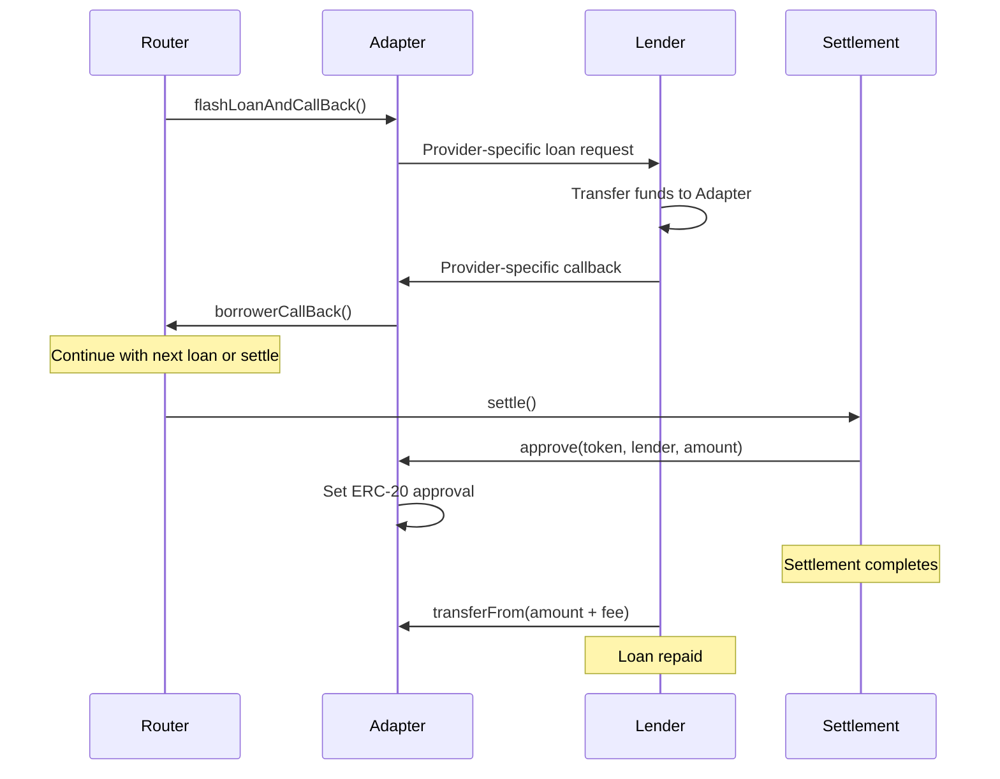

## Overview

Borrower adapters are the bridge between the Flash-Loan Router and flash loan providers. Each adapter implements a standardized interface while handling provider-specific loan request and callback logic.

## Adapter Architecture

The adapter system uses an abstract base contract that provides common functionality:

```solidity src/mixin/Borrower.sol
abstract contract Borrower is IBorrower {
    IFlashLoanRouter public immutable router;
    ICowSettlement public immutable settlementContract;
    
    constructor(IFlashLoanRouter _router) {
        router = _router;
        settlementContract = _router.settlementContract();
    }
}
```

### Key Components

<CardGroup cols={2}>
  <Card title="Router Reference" icon="route">
    Immutable reference to the Flash-Loan Router that coordinates execution
  </Card>
  <Card title="Settlement Reference" icon="file-contract">
    Direct reference to CoW Settlement contract for authorization
  </Card>
  <Card title="Standard Interface" icon="plug">
    Common `IBorrower` interface for router interaction
  </Card>
  <Card title="Access Control" icon="lock">
    Modifiers ensuring only authorized callers
  </Card>
</CardGroup>

## Core Functions

### Router Interaction

The router calls adapters through the standard interface:

```solidity src/mixin/Borrower.sol
function flashLoanAndCallBack(
    address lender,
    IERC20 token,
    uint256 amount,
    bytes calldata callBackData
) external onlyRouter {
    triggerFlashLoan(lender, token, amount, callBackData);
}
```

<ParamField path="lender" type="address" required>
  The flash loan provider contract address
</ParamField>

<ParamField path="token" type="IERC20" required>
  The ERC-20 token to borrow
</ParamField>

<ParamField path="amount" type="uint256" required>
  The amount of tokens to request
</ParamField>

<ParamField path="callBackData" type="bytes" required>
  Data to pass back to the router unchanged
</ParamField>

### Fund Management

Settlements can approve token transfers from borrowers:

```solidity src/mixin/Borrower.sol
function approve(
    IERC20 token,
    address target,
    uint256 amount
) external onlySettlementContract {
    token.forceApprove(target, amount);
}
```

<Info>
**Security**: Only the settlement contract can set approvals. This prevents unauthorized access to borrowed funds.
</Info>

## Implementing an Adapter

To support a new flash loan provider, create a concrete adapter by:

1. **Inheriting** the abstract `Borrower` contract
2. **Implementing** `triggerFlashLoan` for provider-specific requests
3. **Implementing** the provider's callback interface
4. **Forwarding** callbacks to `flashLoanCallBack`

### Required Implementation

```solidity
abstract contract Borrower {
    /// Implement this to request loans from the specific provider
    function triggerFlashLoan(
        address lender,
        IERC20 token,
        uint256 amount,
        bytes calldata callBackData
    ) internal virtual;
    
    /// Call this from the provider's callback function
    function flashLoanCallBack(bytes calldata callBackData) internal {
        router.borrowerCallBack(callBackData);
    }
}
```

## Example: Aave Adapter

The Aave adapter demonstrates the pattern:

<CodeGroup>
```solidity src/AaveBorrower.sol Contract
contract AaveBorrower is Borrower, IAaveFlashLoanReceiver {
    constructor(IFlashLoanRouter _router) Borrower(_router) {}
    
    function triggerFlashLoan(
        address lender,
        IERC20 token,
        uint256 amount,
        bytes calldata callBackData
    ) internal override {
        // Prepare Aave-specific parameters
        address[] memory assets = new address[](1);
        assets[0] = address(token);
        uint256[] memory amounts = new uint256[](1);
        amounts[0] = amount;
        uint256[] memory interestRateModes = new uint256[](1);
        interestRateModes[0] = 0; // No debt position
        
        // Request flash loan from Aave
        IAavePool(lender).flashLoan(
            address(this),
            assets,
            amounts,
            interestRateModes,
            address(this),
            callBackData,
            0 // referralCode
        );
    }
    
    function executeOperation(
        address[] calldata,
        uint256[] calldata,
        uint256[] calldata,
        address,
        bytes calldata callBackData
    ) external returns (bool) {
        flashLoanCallBack(callBackData);
        return true;
    }
}
```

```solidity Key Points
// 1. Inherit both Borrower and provider interface
contract AaveBorrower is Borrower, IAaveFlashLoanReceiver

// 2. Implement triggerFlashLoan with provider-specific logic
function triggerFlashLoan(...) internal override {
    IAavePool(lender).flashLoan(...);
}

// 3. Implement provider's callback and forward to base
function executeOperation(...) external returns (bool) {
    flashLoanCallBack(callBackData);
    return true;
}
```
</CodeGroup>

<Accordion title="Aave Implementation Details">
**Parameter Mapping**:
- `assets`: Single-element array with token address
- `amounts`: Single-element array with loan amount
- `interestRateModes`: Set to `[0]` to avoid opening debt positions
- `params`: Pass through `callBackData` unchanged
- `referralCode`: Set to `0` (currently inactive)

**Callback Contract**:
- Must implement `IAaveFlashLoanReceiver.executeOperation`
- Receives loan details and custom parameters
- Returns `true` to indicate success
- Calls `flashLoanCallBack` to continue router execution
</Accordion>

## Example: ERC-3156 Adapter

The ERC-3156 adapter shows a simpler pattern:

<CodeGroup>
```solidity src/ERC3156Borrower.sol Contract
contract ERC3156Borrower is Borrower, IERC3156FlashBorrower {
    bytes32 private constant ERC3156_ONFLASHLOAN_SUCCESS = 
        keccak256("ERC3156FlashBorrower.onFlashLoan");
    
    constructor(IFlashLoanRouter _router) Borrower(_router) {}
    
    function triggerFlashLoan(
        address lender,
        IERC20 token,
        uint256 amount,
        bytes calldata callBackData
    ) internal override {
        bool success = IERC3156FlashLender(lender).flashLoan(
            this,
            address(token),
            amount,
            callBackData
        );
        require(success, "Flash loan was unsuccessful");
    }
    
    function onFlashLoan(
        address,
        address,
        uint256,
        uint256,
        bytes calldata callBackData
    ) external returns (bytes32) {
        flashLoanCallBack(callBackData);
        return ERC3156_ONFLASHLOAN_SUCCESS;
    }
}
```

```solidity Key Points
// 1. Much simpler than Aave - standard interface
IERC3156FlashLender(lender).flashLoan(
    this,           // receiver
    address(token), // token
    amount,         // amount
    callBackData    // data
);

// 2. Must return specific success constant
return keccak256("ERC3156FlashBorrower.onFlashLoan");
```
</CodeGroup>

<Info>
ERC-3156 provides a standardized interface, making adapters simpler and more uniform across providers.
</Info>

## Access Control

Adapters enforce strict access control:

### Router-Only Access

```solidity src/mixin/Borrower.sol
modifier onlyRouter() {
    require(msg.sender == address(router), "Not the router");
    _;
}
```

Only the registered router can trigger flash loans through the adapter.

### Settlement-Only Access

```solidity src/mixin/Borrower.sol
modifier onlySettlementContract() {
    require(
        msg.sender == address(settlementContract),
        "Only callable in a settlement"
    );
    _;
}
```

Only the settlement contract can approve token transfers from the adapter.

<Warning>
**Security**: These access controls ensure that:
- Only the router can initiate loans
- Only settlements can access borrowed funds
- External callers cannot disrupt the execution flow
</Warning>

## Fund Flow

The adapter manages fund flow between lenders, router, and settlement:



## Adding New Providers

To add support for a new flash loan provider:

<Steps>
  <Step title="Research Provider API">
    Understand the provider's flash loan request and callback mechanisms
  </Step>
  
  <Step title="Create Adapter Contract">
    ```solidity
    contract NewProviderBorrower is Borrower, IProviderCallback {
        constructor(IFlashLoanRouter _router) Borrower(_router) {}
        // Implementation here
    }
    ```
  </Step>
  
  <Step title="Implement triggerFlashLoan">
    Map standard parameters to provider-specific request format
  </Step>
  
  <Step title="Implement Provider Callback">
    Forward the provider's callback to `flashLoanCallBack(callBackData)`
  </Step>
  
  <Step title="Deploy and Test">
    Deploy the adapter and test with the router on testnets
  </Step>
  
  <Step title="Update Documentation">
    Document the new provider and its adapter address
  </Step>
</Steps>

## Best Practices

<AccordionGroup>
  <Accordion title="Always Pass Data Unchanged">
    The `callBackData` parameter must be passed to the router exactly as received. Never modify, parse, or validate this data in the adapter.
    
    ```solidity
    // ✓ Correct
    flashLoanCallBack(callBackData);
    
    // ✗ Wrong - modifying data
    flashLoanCallBack(abi.encode(parsed));
    ```
  </Accordion>
  
  <Accordion title="Handle Provider-Specific Requirements">
    Each provider has unique requirements:
    - Aave requires arrays and specific return values
    - ERC-3156 requires returning a success constant
    - Some providers may charge fees
    
    Ensure your adapter handles all provider-specific requirements correctly.
  </Accordion>
  
  <Accordion title="Validate Provider Responses">
    Check for success conditions specific to the provider:
    
    ```solidity
    bool success = IERC3156FlashLender(lender).flashLoan(...);
    require(success, "Flash loan was unsuccessful");
    ```
  </Accordion>
  
  <Accordion title="Use Immutable References">
    Router and settlement references should be immutable for security:
    
    ```solidity
    IFlashLoanRouter public immutable router;
    ICowSettlement public immutable settlementContract;
    ```
  </Accordion>
</AccordionGroup>

## Next Steps

<CardGroup cols={2}>
  <Card title="Flash Loans" icon="bolt" href="/concepts/flash-loans">
    Learn about flash loan fundamentals
  </Card>
  <Card title="Security Model" icon="shield" href="/concepts/security-model">
    Understand security guarantees
  </Card>
</CardGroup>
