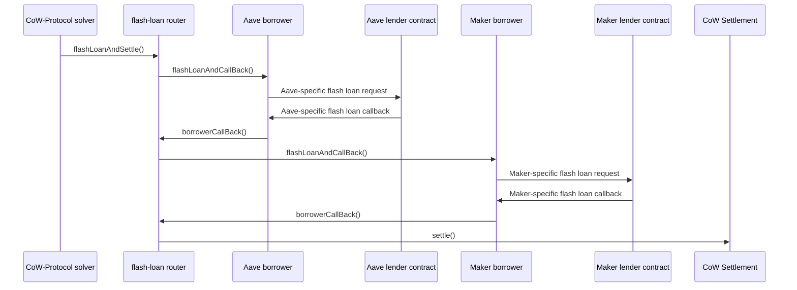

## What are Flash Loans?

Flash loans are uncollateralized loans that must be borrowed and repaid within a single transaction. They enable solvers to access large amounts of capital without upfront collateral, provided the loan is fully repaid by the end of the transaction execution.

The Flash-Loan Router allows CoW Protocol solvers to execute settlements with the ability to use funds from one or more flash loans, enabling more capital-efficient trading strategies.

## Supported Providers

The router currently supports two types of flash loan providers:

<CardGroup cols={2}>
  <Card title="ERC-3156" icon="file-contract">
    Any lender compatible with the [ERC-3156](https://eips.ethereum.org/EIPS/eip-3156) standard interface, including Maker's Flash Mint Module.
  </Card>
  <Card title="Aave" icon="coins">
    [Aave Protocol](https://aave.com/docs/developers/flash-loans#overview) flash loans with native integration.
  </Card>
</CardGroup>

### Provider Addresses

All contracts are deployed deterministically with `CREATE2` and have the same address across all supported networks:

- **FlashLoanRouter**: `0x9da8B48441583a2b93e2eF8213aAD0EC0b392C69`
- **AaveBorrower**: `0x7d9C4DeE56933151Bc5C909cfe09DEf0d315CB4A`
- **ERC3156Borrower**: `0x47d71b4B3336AB2729436186C216955F3C27cD04`

<Info>
These addresses are consistent across all networks where the protocol is deployed. See the [networks.json](https://github.com/cowprotocol/flash-loan-router/blob/main/networks.json) file for deployment details.
</Info>

## How Flash Loans Work

The flash loan lifecycle follows this sequence:

1. **Request**: Solver calls `flashLoanAndSettle()` with loan specifications
2. **Borrow**: Router requests loans from specified providers via borrower adapters
3. **Execute**: Settlement executes with access to borrowed funds
4. **Repay**: Settlement returns borrowed funds plus fees to lenders
5. **Verify**: Transaction reverts if any loan cannot be repaid

<Accordion title="Example: Settlement with Two Loans (Aave + Maker)">


Each flash loan is processed sequentially, with the settlement executing only after all loans are obtained.
</Accordion>

## Loan Specification

Each flash loan request requires the following parameters:

<ParamField path="amount" type="uint256" required>
  The amount of tokens to borrow
</ParamField>

<ParamField path="token" type="address" required>
  The ERC-20 token contract address to borrow
</ParamField>

<ParamField path="lender" type="address" required>
  The flash loan provider contract (e.g., Balancer, Aave, Maker)
</ParamField>

<ParamField path="borrower" type="address" required>
  The adapter contract that makes the specific lender implementation compatible with the router
</ParamField>

## Fund Management

### Accessing Loaned Funds

The only way to move funds out of a borrower is through ERC-20 approvals:

```solidity
// Called during settlement to approve fund transfers
borrower.approve(token, spender, amount);
```

<Info>
**Best Practice**: Set unlimited approvals once for the settlement contract and reuse them across multiple settlements to save gas.
</Info>

### Repayment Process

Repayment mechanisms vary by provider:

1. **Transfer**: Settlement transfers borrowed funds back to the borrower
2. **Approve**: Settlement sets an approval for the lender to spend borrower's funds
3. **Pull**: Lender pulls funds back using `transferFrom` after settlement completes

<Warning>
Inability to repay a flash loan will cause the entire transaction to revert. Ensure your settlement logic accounts for:
- Loan principal amounts
- Provider-specific fees
- Sufficient token balances in borrower contracts
</Warning>

## Adding New Providers

Support for additional flash loan providers can be added by implementing a new borrower adapter. See [Borrower Adapters](/concepts/borrower-adapters) for implementation details.

## Next Steps

<CardGroup cols={2}>
  <Card title="Router Design" icon="route" href="/concepts/router-design">
    Learn about the router's execution flow
  </Card>
  <Card title="Borrower Adapters" icon="plug" href="/concepts/borrower-adapters">
    Understand the adapter architecture
  </Card>
</CardGroup>
