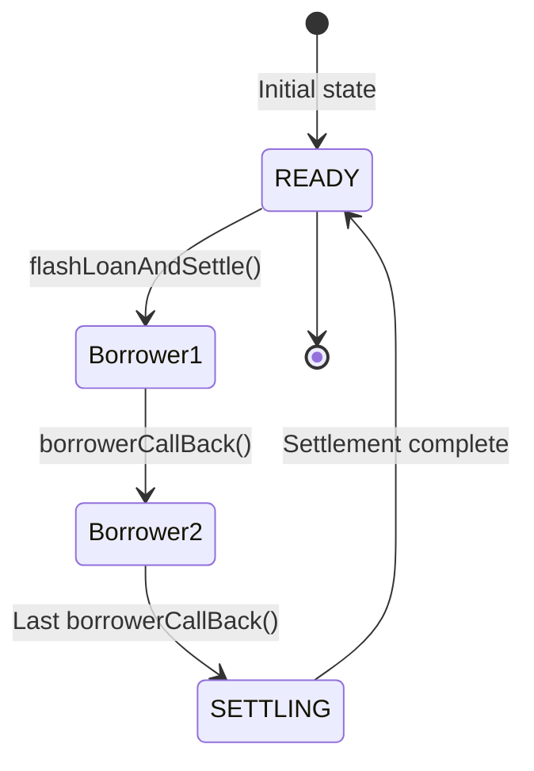
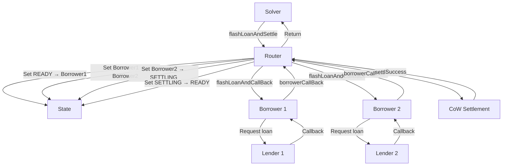

## Overview

The Flash-Loan Router is a specialized solver contract for CoW Protocol that enables settlements to execute with flash loan capital. It orchestrates the loan request process, manages execution state, and ensures secure settlement execution.

## Entry Point

The router's main entry point is the `flashLoanAndSettle` function:

```solidity src/FlashLoanRouter.sol
function flashLoanAndSettle(
    Loan.Data[] calldata loans,
    bytes calldata settlement
) external onlySolver
```

### Parameters

<ParamField path="loans" type="Loan.Data[]" required>
  Array of flash loan specifications, each containing:
  - `amount`: Tokens to borrow
  - `token`: ERC-20 token address
  - `lender`: Flash loan provider contract
  - `borrower`: Adapter contract for the lender
</ParamField>

<ParamField path="settlement" type="bytes" required>
  ABI-encoded call data for the `settle()` function on the CoW Settlement contract
</ParamField>

<Info>
**Access Control**: Only registered CoW Protocol solvers can call `flashLoanAndSettle`. Authentication is verified through the settlement contract's authenticator.
</Info>

## Execution Flow

The router follows a carefully orchestrated execution sequence:

### 1. Initial Validation

```solidity src/FlashLoanRouter.sol
require(pendingBorrower == READY, "Another settlement in progress");
emit Settlement(msg.sender);
```

- Verifies no other settlement is in progress
- Emits `Settlement` event with solver's address
- Prevents reentrancy attacks

### 2. Loan Processing

Loans are processed sequentially in the order provided:

```solidity src/FlashLoanRouter.sol
function borrowNextLoan(bytes memory loansWithSettlement) private {
    if (loansWithSettlement.loanCount() == 0) {
        pendingBorrower = SETTLING;
        settle(loansWithSettlement.destroyToSettlement());
    } else {
        (uint256 amount, IBorrower borrower, address lender, IERC20 token) = 
            loansWithSettlement.popLoan();
        pendingBorrower = borrower;
        pendingDataHash = loansWithSettlement.hash();
        borrower.flashLoanAndCallBack(lender, token, amount, loansWithSettlement);
    }
}
```

<Accordion title="Loan Processing Steps">
1. **Check Remaining Loans**: If no loans remain, proceed to settlement
2. **Extract Next Loan**: Pop the next loan from the queue
3. **Set Pending Borrower**: Store which borrower should call back
4. **Store Data Hash**: Save hash of remaining data for validation
5. **Trigger Flash Loan**: Request loan from borrower adapter
6. **Await Callback**: Wait for borrower to receive funds and call back
</Accordion>

### 3. Borrower Callbacks

Each borrower calls back the router after receiving funds:

```solidity src/FlashLoanRouter.sol
function borrowerCallBack(bytes memory loansWithSettlement) 
    external 
    onlyPendingBorrower 
{
    require(
        loansWithSettlement.hash() == pendingDataHash,
        "Data from borrower not matching"
    );
    borrowNextLoan(loansWithSettlement);
}
```

- **Authentication**: Only the expected borrower can call back
- **Data Integrity**: Validates the data hasn't been tampered with
- **Continuation**: Processes the next loan in the queue

### 4. Settlement Execution

Once all loans are obtained:

```solidity src/FlashLoanRouter.sol
function settle(bytes memory settlement) private {
    require(
        selector(settlement) == ICowSettlement.settle.selector,
        "Only settle() is allowed"
    );
    (bool result,) = address(settlementContract).call(settlement);
    require(result, "Settlement reverted");
}
```

- Validates the call is to the `settle()` function
- Executes the settlement with borrowed funds
- Reverts if settlement fails

### 5. Cleanup

```solidity src/FlashLoanRouter.sol
require(pendingBorrower == SETTLING, "Terminated without settling");
pendingBorrower = READY;
```

- Verifies settlement was executed
- Resets state for next use
- Enables same-transaction reuse

## State Management

The router uses transient state variables to control execution:

### Pending Borrower States

<CodeGroup>
```solidity READY
IBorrower internal constant READY = IBorrower(address(0));
// Default state before/after settlement
```

```solidity SETTLING
IBorrower internal constant SETTLING = 
    IBorrower(address(bytes20(keccak256("FlashLoanRouter: settling"))));
// State during settlement execution
```

```solidity BORROWER_ADDRESS
// Set to the address of the borrower expected to call back
pendingBorrower = borrower;
```
</CodeGroup>

### State Transitions



<Info>
The router uses **transient storage** for state variables, making it gas-efficient and enabling multiple settlements within the same transaction.
</Info>

## Security Guarantees

The router enforces strict execution control:

### Immutable Execution Flow

<Check>**Solver Control**: Only registered solvers can initiate settlements</Check>
<Check>**Single Settlement**: Each call results in exactly one `settle()` execution</Check>
<Check>**Data Integrity**: Settlement call data matches the input exactly</Check>
<Check>**Sequential Processing**: Loans are processed in the specified order</Check>

### Protection Against Attacks

<Warning>
**Reentrancy Protection**: The `pendingBorrower` state prevents concurrent settlement execution.
</Warning>

<Warning>
**Call Validation**: The router verifies that only the expected borrower calls back and only at the right time.
</Warning>

<Warning>
**Data Tampering**: Hash verification ensures borrowers cannot modify the loan queue or settlement data.
</Warning>

## Out-of-Order Execution

The router strictly enforces loan ordering:

```solidity src/FlashLoanRouter.sol
modifier onlyPendingBorrower() {
    require(
        msg.sender == address(pendingBorrower),
        "Not the pending borrower"
    );
    _;
}
```

Attempting to process loans out of order will cause transaction revert.

## Execution Context

Key properties of the execution environment:

- **Call Depth**: All operations occur within a single transaction
- **Call Context**: Never transfers control permanently (always returns)
- **Atomicity**: Any failure reverts the entire transaction
- **Gas Efficiency**: Optimized for minimal overhead

## Architecture Diagram



## Next Steps

<CardGroup cols={2}>
  <Card title="Borrower Adapters" icon="plug" href="/concepts/borrower-adapters">
    Learn how adapters integrate lenders
  </Card>
  <Card title="Security Model" icon="shield" href="/concepts/security-model">
    Understand security guarantees
  </Card>
</CardGroup>
