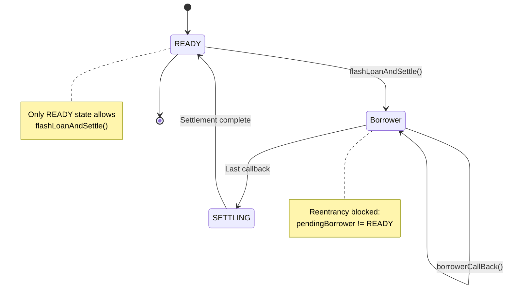

## Security Principles

The Flash-Loan Router is designed with security as the primary concern. The architecture ensures that solvers maintain complete control over settlement execution while preventing unauthorized access and malicious interference.

<CardGroup cols={2}>
  <Card title="Solver Control" icon="user-shield">
    Only registered solvers can execute settlements
  </Card>
  <Card title="Data Integrity" icon="fingerprint">
    Settlement data cannot be tampered with during execution
  </Card>
  <Card title="Execution Guarantees" icon="check-double">
    One call results in exactly one settlement
  </Card>
  <Card title="Reentrancy Protection" icon="ban">
    State management prevents concurrent execution
  </Card>
</CardGroup>

## Router Security

### Solver Authentication

Only registered CoW Protocol solvers can use the router:

```solidity src/FlashLoanRouter.sol
modifier onlySolver() {
    require(
        settlementAuthentication.isSolver(msg.sender),
        "Not a solver"
    );
    _;
}

function flashLoanAndSettle(
    Loan.Data[] calldata loans,
    bytes calldata settlement
) external onlySolver {
    // ...
}
```

<Info>
**Authentication Source**: The router queries the same authentication contract used by the CoW Settlement contract, ensuring consistency across the protocol.
</Info>

#### Authentication Properties

<Check>Solver registry is managed by CoW Protocol governance</Check>
<Check>Router cannot authenticate itself as a solver</Check>
<Check>Authentication is checked before any state changes</Check>
<Check>Failed authentication reverts immediately</Check>

### Execution Control

The router guarantees strict execution properties:

```solidity src/FlashLoanRouter.sol
function flashLoanAndSettle(
    Loan.Data[] calldata loans,
    bytes calldata settlement
) external onlySolver {
    require(pendingBorrower == READY, "Another settlement in progress");
    emit Settlement(msg.sender);
    bytes memory loansWithSettlement = LoansWithSettlement.encode(loans, settlement);
    borrowNextLoan(loansWithSettlement);
    require(pendingBorrower == SETTLING, "Terminated without settling");
    pendingBorrower = READY;
}
```

#### Key Guarantees

<AccordionGroup>
  <Accordion title="Single Settlement Per Call">
    Each call to `flashLoanAndSettle` results in exactly one call to `settle()`:
    
    ```solidity
    // State transitions enforce single settlement
    READY → Borrower1 → Borrower2 → SETTLING → READY
    //                                    ↑
    //                            settle() called here
    ```
    
    The `SETTLING` state is only reachable through the settlement path, and the final check verifies it was reached.
  </Accordion>
  
  <Accordion title="Immutable Settlement Data">
    Settlement call data cannot be modified after `flashLoanAndSettle` is called:
    
    ```solidity src/FlashLoanRouter.sol
    // Data is hashed and verified at each callback
    pendingDataHash = loansWithSettlement.hash();
    
    // Later, in borrowerCallBack:
    require(
        loansWithSettlement.hash() == pendingDataHash,
        "Data from borrower not matching"
    );
    ```
    
    Any tampering causes immediate revert.
  </Accordion>
  
  <Accordion title="Sequential Loan Processing">
    Loans are processed in the exact order specified:
    
    ```solidity src/FlashLoanRouter.sol
    // Only the expected borrower can call back
    modifier onlyPendingBorrower() {
        require(
            msg.sender == address(pendingBorrower),
            "Not the pending borrower"
        );
        _;
    }
    ```
    
    Out-of-order execution is impossible and causes transaction revert.
  </Accordion>
  
  <Accordion title="Settlement Function Validation">
    Only the `settle()` function can be called:
    
    ```solidity src/FlashLoanRouter.sol
    function settle(bytes memory settlement) private {
        require(
            selector(settlement) == ICowSettlement.settle.selector,
            "Only settle() is allowed"
        );
        (bool result,) = address(settlementContract).call(settlement);
        require(result, "Settlement reverted");
    }
    ```
    
    Attempts to call other functions are rejected.
  </Accordion>
</AccordionGroup>

### Reentrancy Protection

The router uses state-based reentrancy protection:

```solidity src/FlashLoanRouter.sol
// State transitions prevent reentrancy
require(pendingBorrower == READY, "Another settlement in progress");

// During execution, pendingBorrower is never READY:
// READY → Borrower → ... → Borrower → SETTLING → READY
```

<Warning>
**Reentrancy Prevention**: The `pendingBorrower` variable ensures that:
- No nested calls to `flashLoanAndSettle` can succeed
- State is consistent throughout execution
- Multiple borrowers cannot call back simultaneously
</Warning>

#### Protection Mechanism



## Borrower Security

### Access Control

Borrowers enforce strict access control:

<CodeGroup>
```solidity Router Access
modifier onlyRouter() {
    require(msg.sender == address(router), "Not the router");
    _;
}

// Only router can trigger loans
function flashLoanAndCallBack(...) external onlyRouter {
    triggerFlashLoan(...);
}
```

```solidity Settlement Access
modifier onlySettlementContract() {
    require(
        msg.sender == address(settlementContract),
        "Only callable in a settlement"
    );
    _;
}

// Only settlement can approve transfers
function approve(...) external onlySettlementContract {
    token.forceApprove(...);
}
```
</CodeGroup>

### Fund Protection

Borrowers protect borrowed funds through controlled access:

```solidity src/mixin/Borrower.sol
function approve(
    IERC20 token,
    address target,
    uint256 amount
) external onlySettlementContract {
    token.forceApprove(target, amount);
}
```

<Info>
**Fund Security**: The only way to access funds in a borrower is through ERC-20 approvals, which can only be set by the settlement contract during authorized execution.
</Info>

#### Security Properties

<Check>External callers cannot set approvals</Check>
<Check>Funds cannot be transferred without settlement approval</Check>
<Check>Approvals can only be set during active settlement</Check>
<Check>Unused approvals don't pose security risks</Check>

### Unauthorized Access Impact

Borrowers are designed to be resilient against unauthorized access:

<Card title="No Impact on Adapter Functionality" icon="shield-check">
  Unauthorized external calls to borrowers cannot:
  - Impair their ability to act as adapters
  - Modify expected contract behavior
  - Access or steal borrowed funds
  - Disrupt the router's execution flow
</Card>

## Threat Model

### Protected Against

The system provides strong protection against:

<AccordionGroup>
  <Accordion title="Unauthorized Settlement Execution">
    **Threat**: Non-solvers attempting to execute settlements
    
    **Protection**: `onlySolver` modifier checks authentication before any operations
    
    **Result**: Transaction reverts immediately for non-solvers
  </Accordion>
  
  <Accordion title="Settlement Data Tampering">
    **Threat**: Malicious borrowers or lenders modifying settlement data
    
    **Protection**: Hash verification at each callback
    
    **Result**: Any data modification causes transaction revert
  </Accordion>
  
  <Accordion title="Reentrancy Attacks">
    **Threat**: Malicious contracts attempting nested settlements
    
    **Protection**: State-based execution control via `pendingBorrower`
    
    **Result**: Reentrancy attempts fail the `READY` check
  </Accordion>
  
  <Accordion title="Out-of-Order Execution">
    **Threat**: Borrowers calling back in wrong order
    
    **Protection**: `onlyPendingBorrower` modifier
    
    **Result**: Only expected borrower can call back at each step
  </Accordion>
  
  <Accordion title="Unauthorized Fund Access">
    **Threat**: External callers attempting to access borrowed funds
    
    **Protection**: `onlySettlementContract` modifier on `approve`
    
    **Result**: Only settlement can authorize fund transfers
  </Accordion>
  
  <Accordion title="Multiple Settlement Calls">
    **Threat**: Single call attempting multiple settlements
    
    **Protection**: State transitions and final state verification
    
    **Result**: Exactly one settlement per call, enforced by state machine
  </Accordion>
</AccordionGroup>

### Risk Factors

While user funds remain secure, solvers face risks from malicious participants:

<Warning>
**Chain State Manipulation**: A malicious token, lender, or borrower can modify chain state before the `settle()` call, potentially:
- Triggering transaction revert
- Exploiting slippage tolerance
- Causing settlement to execute at unfavorable prices

**Impact**: Does not affect user fund security, but increases solver execution risk
</Warning>

<Info>
**Risk Mitigation**: Assuming trusted tokens, lenders, and borrowers, risks are comparable to normal settlement execution. Solvers should:
- Only use reputable flash loan providers
- Verify borrower contract implementations
- Use appropriate slippage protections
- Monitor for abnormal provider behavior
</Info>

## Trust Assumptions

The security model makes explicit trust assumptions:

### Trusted Components

<CardGroup cols={2}>
  <Card title="CoW Protocol" icon="cow">
    - Settlement contract
    - Authentication contract
    - Solver registry
  </Card>
  <Card title="Router System" icon="route">
    - FlashLoanRouter contract
    - Borrower adapter contracts
    - Deployment addresses
  </Card>
</CardGroup>

### External Components

The following are external and require solver due diligence:

<Warning>
**Flash Loan Providers**: Lenders (Aave, Maker, etc.) are external contracts not controlled by the protocol. Solvers should:
- Verify provider contract addresses
- Understand fee structures
- Monitor for upgrades or changes
- Have contingency plans for provider issues
</Warning>

<Warning>
**ERC-20 Tokens**: Tokens borrowed and traded are external contracts. Solvers should:
- Only use well-audited token contracts
- Understand token-specific behaviors (fees, rebasing, etc.)
- Be aware of token upgrade mechanisms
- Monitor for malicious token behavior
</Warning>

## Security Best Practices

For solvers using the router:

<Steps>
  <Step title="Verify Contract Addresses">
    Always use official deployment addresses:
    - FlashLoanRouter: `0x9da8B48441583a2b93e2eF8213aAD0EC0b392C69`
    - AaveBorrower: `0x7d9C4DeE56933151Bc5C909cfe09DEf0d315CB4A`
    - ERC3156Borrower: `0x47d71b4B3336AB2729436186C216955F3C27cD04`
  </Step>
  
  <Step title="Use Reputable Providers">
    Only request flash loans from well-known, audited providers like Aave and Maker
  </Step>
  
  <Step title="Implement Slippage Protection">
    Include appropriate slippage checks in settlement logic to protect against state manipulation
  </Step>
  
  <Step title="Monitor Execution">
    Track settlement execution for anomalies or unexpected behavior
  </Step>
  
  <Step title="Maintain Approvals">
    Set unlimited approvals once for settlement contract to borrowers, reducing per-transaction gas costs
  </Step>
  
  <Step title="Handle Failures Gracefully">
    Implement fallback logic for flash loan failures or settlement reverts
  </Step>
</Steps>

## Audit Status

The Flash-Loan Router contracts have been designed with security as the primary focus:

<Info>
For the latest audit reports and security updates, refer to the [CoW Protocol documentation](https://docs.cow.fi/) and [GitHub repository](https://github.com/cowprotocol/flash-loan-router).
</Info>

## Next Steps

<CardGroup cols={2}>
  <Card title="Router Design" icon="route" href="/concepts/router-design">
    Understand the execution flow
  </Card>
  <Card title="Quick Start" icon="rocket" href="/getting-started/quickstart">
    Start building with the router
  </Card>
</CardGroup>
